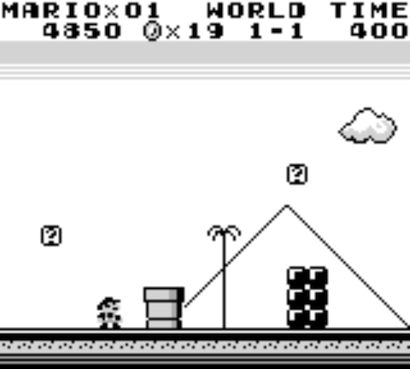
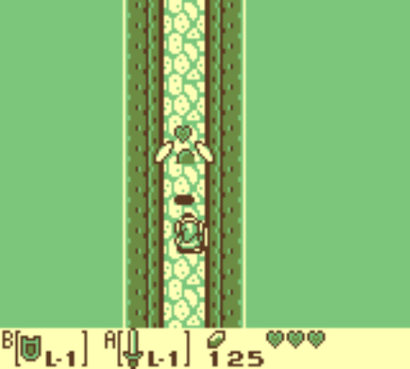
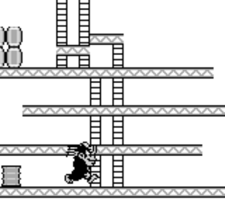
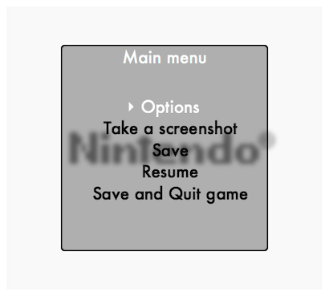

# Gameboy Emulator

| |Overview  | 
| - | - |
|Course| CS-449 Systems for Data Science|
| Year | Autumn 2017 |
| Final Grade | **5.5** / 6 |
| Languages | Java 8 |
| Team size | 2 |

A working Gameboy emulator implemented in Java in the context of the EPFL CS-108 Oriented Programming Pratice class in close collaboration with Julien Benhaim. The emulator is implemented from scratch in Java and JavaFx and works with any cartridge, such as the ones in `data/ROMs`. The source code is located in `src/ch/epfl/gameboj/`. In addition to the gameboy, we leveraged the opportunity to improve the emulator by creating a menu from which we have access to different options. For instance, we can pause the emulator, save the current state, change the color palette or accelerate the emulation speed.

  
   

  
   

